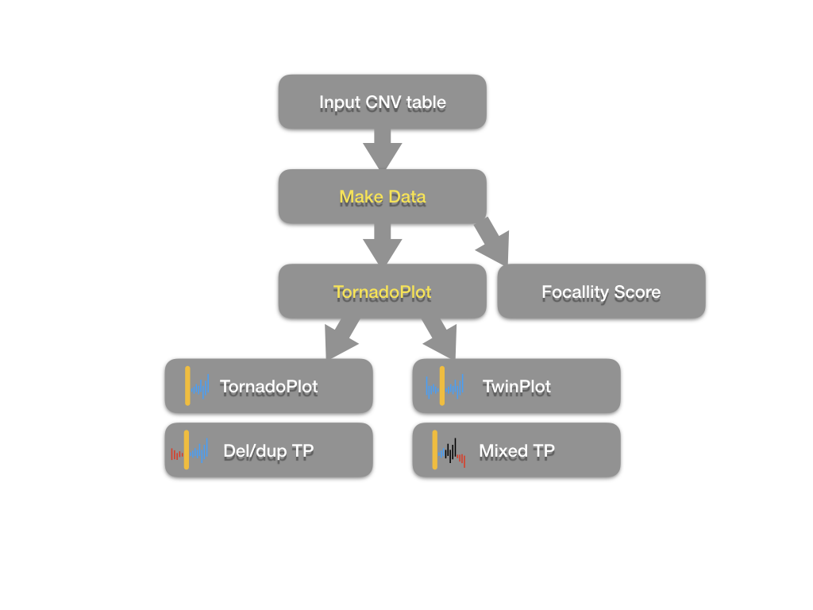
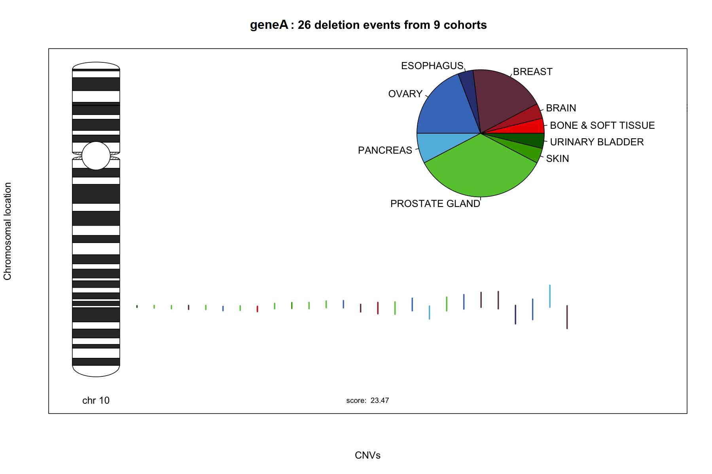
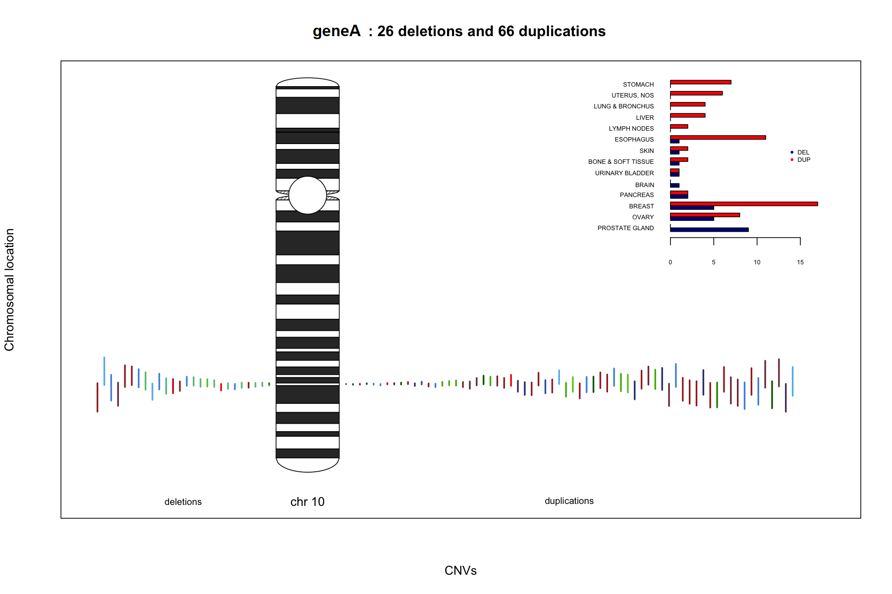
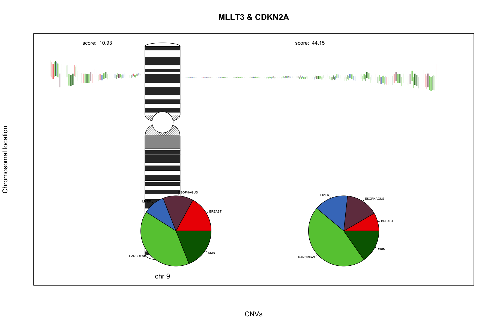
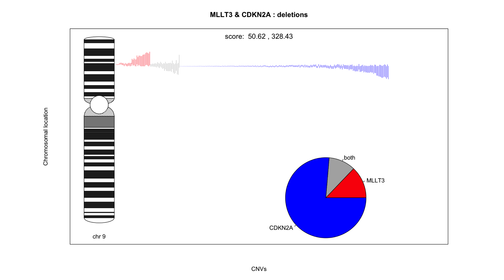

## GenomeTornadoPlot

The TornadoPlot package is used to visualise copy number variations (or any other types of structure variations as well) which overlap with one or two genes in one chromosomes.A focallity score is also calculated for all CNVs overlapping with the target gene. 

With `GenomeTornadoPlot` Package, you are able to:
- visualise alternatively selected CNVs overlapping with gene(s) in cohort level
- calculate focallity scores by different methods
- graphically compare CNVs between neighbour genes


## Download and installation

Before installing the GenomeTornadoPlot, please install all the dependencies firstly.

```R
inst.pkgs = c('ggplot2', 'data.table', 'devtools',
	      'ggplot2', 'grid', 'gridExtra', ‘IRanges’,’tiff')
	      
install.packages(inst.pkgs)

if (!requireNamespace("BiocManager", quietly = TRUE))
    install.packages("BiocManager")
    
BiocManager::install(c(“GenomicRanges”,”quantsmooth"))
```
## Workflow
<p align="center">

</p>


## Installing
1. In the Git repository click on "Clone or Download".
2. Copy the HTTPS link.
3. Open a terminal and type or paste:
```bash
git clone https://github.com/chenhong-dkfz/tornado.test.1
```
4. Open the folder tornado.test.1 and open the “tornado.test.1.Rproj” file in RStudio.
5. In the RStudio console, type:
```R
devtools::install()
```

## Usage

TornadoPlot package can be applied to your CNV data. Basically, you can use `MakeData` function to convert data.frame object to standard input object of `TornadoPlot` function. 

To run `MakeData` function:

```R
data <- MakeData(CNV,gene_name_1,gene_name_2,score.type="del")

```

Here **CNV** is your input data frame of CNV information. The input table should be like this:


```R
data("cnv_KRAS",package = "tornado.test.1")
knitr::kable(head(cnv_KRAS, 10))
```
| Chromosome|    Start|      End| Score|Gene |Cohort |PID       |
|----------:|--------:|--------:|-----:|:----|:------|:---------|
|         12| 29700429| 12145150|     5|KRAS |AML    |pid001 |
|         12| 21073451|  1777272|     5|KRAS |BRCA   |pid002 |
|         12| 32285455| 18368484|     5|KRAS |CRC    |pid003 |
|         12| 24497489| 20635970|     5|KRAS |CRC    |pid004 |
|         12| 23188787| 31463459|     4|KRAS |AML    |pid005 |
|         12| 25224933|  7439941|     6|KRAS |CRC    |pid006 |
|         12| 24801696| 11310196|     5|KRAS |CRC    |pid007 |
|         12| 24459199| 27108934|     5|KRAS |GLIOMA |pid008 |
|         12| 30812917| 17582810|     4|KRAS |BRCA   |pid009 |
|         12| 21706333| 14115764|     5|KRAS |CRC    |pid010 |

The **score** column records copy numbers of each CNV.


The other parameters are defined:

1. **gene_name_1**: the name of the first gene.
1. **gene_name_2**: the name of the second gene, optional.
1. **score.type**: type of CNV which are computed for focallity scores, "del" as default.

if gene_name_2 is not given by user, `MakeData` function will generate an object for single-gene cnv, otherwise it would make an object for twin-gene cnvs. 


```R
cnv.plot <- TornadoPlots(data, legend, color, color.method, sort.method, SaveAsObject)
```
1. **data**: generated by `MakeData` function.
1. **legend**: could be set to "pie" and "normal", optional.
#1. **out.dir**: path to save the output tornado plot, optional.
#1. **file.type**: set the format of output tornado plot. The plot is defaultly saved in tiff format, optional.
1. **color**: a vector of CNV colors, optional.
1. **color.method**: how to color the CNVs. It could be "cohort" or "ploidy", optional.
1. **sort.method**: how to sort the CNVs. It could be "length",cohort" or "ploidy", optional.
1. **SaveAsObject**: if it is TRUE, return an rastergrob object. Otherwise the function only save the plot in file without return anything.

## Example

You can simply use the following code to make a tornado plot. The first example is for a single gene.
```R
data("cnv_GENEA",package = "tornado.test.1")
data_genea <-  MakeData(CNV_1=cnv_GENEA,gene_name_1 = "GENEA")
plot_genea <- TornadoPlots(data_genea,gene.name="GENEA",sort.method="cohort",SaveAsObject=T)
```
Plot standard Genome Tornado Plot:

Colourful lines stand for CNV events, and the start and position corresponding to the chromosome show the event positions.
The pie chart stand for the cohort contribution of the events.
The colors in this example stand for cohort. But users can also change parameter and make the color for copy numbers or length.
The score below the graph is the “focallity score” of the gene.


```R
grid.arrange(plot_genea[[1]])
```
<p align="center">

</p>


Plot deletion/duplication plot:
```R
grid.arrage(plot_genea[[2]])
```
<p align="center">

</p>


We can also apply GenomeTornadoPlot for gene pairs.
```R
data("MLLT3_CDKN2A",package = "tornado.test.1")
data_twin <-  MakeData(CNV_1=MLLT3_CDKN2A,gene_name_1 = "MLLT3",gene_name_2="CDKN2A")
plot_twin <- TornadoPlots(data_twin,sort.method="cohort",SaveAsObject=T)
```
Plot twin plot:
```R
grid.arrange(plot_twin[[1]])
```
<p align="center">

</p>

plot mixed plot:
```R
grid.arrange(plot_twin[[2]])
```
<p align="center">

</p>

In addition, the mixed plot shows the proportion of events are overlapped or invidually affect one single gene.

## References

[1]G.R. Bignell, C.D. Greenman, H. Davies, A.P. Butler
Signatures of mutation and selection in the cancer genome
Nature, 463 (2010), pp. 893-898

[2]M. Bierkens, O. Krijgsman, S.M. Wilting, L. Bosch, A. Jaspers, G.A. Meijer, et al.
Focal aberrations indicate EYA2and hsa-miR-375as oncogene and tumor suppressor in cervical carcinogenesis
Genes Chromosom. Cancer, 52 (2012), pp. 56-68

[3]C. Garnis, W.W. Lockwood, E. Vucic, Y. Ge, L. Girard, J.D. Minna, et al.
High resolution analysis of non-small cell lung cancer cell lines by whole genome tiling path array CGH
Int. J. Cancer, 118 (2005), pp. 1556-1564

[4]R.J. Leary, J.C. Lin, J. Cummins, S. Boca, L.D. Wood, D.W. Parsons, et al.
Integrated analysis of homozygous deletions, focal amplifications, and sequence alterations in breast and colorectal cancers
Proc. Natl. Acad. Sci. U. S. A., 105 (2008), pp. 16224-16229

[5]Meuwissen R, Linn SC, Linnoila RI, Zevenhoven J, Mooi WJ, Berns A. Induction of small cell lung cancer by somatic inactivation of both Trp53 and Rb1 in a conditional mouse model. Cancer Cell. 2003;4(3):181–9.

[6]Campbell, P. J. et al. Pan-cancer analysis of whole genomes. bioRxiv (2017).

[7]Cancer Genome Atlas Research Network, Weinstein JN, Collisson EA, et al. The Cancer Genome Atlas Pan-Cancer analysis project. Nat Genet. 2013;45(10):1113–1120. doi:10.1038/ng.2764

## Licence
tbd
