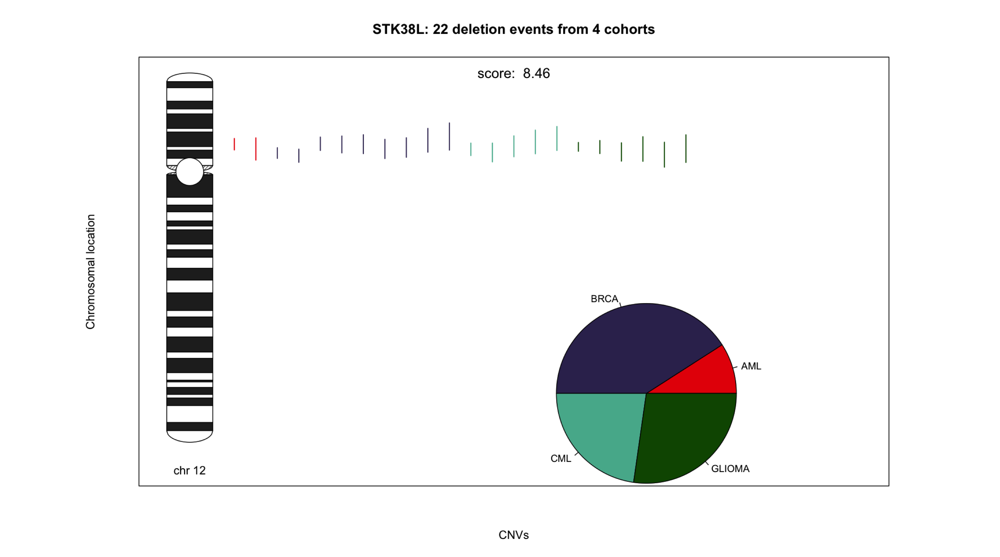

# GenomeTornadoPlot

Authors: Chen Hong<sup>1,2,3</sup>, Robin Thiele<sup>1,2</sup>, Lars Feuerbach<sup>1</sup>

Affiliations:\
1 Division of Applied Bioinformatics, German Cancer Research Center (DKFZ), Heidelberg, Germany.\
2 Faculty of Biosciences, Heidelberg University, Heidelberg, Germany.\
3 German Cancer Consortium (DKTK), German Cancer Research Center (DKFZ), Heidelberg, Germany.


The GenomeTornadoPlot package allow users to visualize copy number variations (CNVs), and many other types of structure variations as well, which overlap with one or two genes in one chromosomes. For all CNVs overlapping with the target gene a focallity score is also calculated. Higher the focallity score is, more probable it is that the gene is affected by focal events.


## Motivation

Focal copy number variations pinpoint driver genes. More specifically, oncogenes and tumor suppressor genes are more often affected by these events than neighbouring passenger. Furthermore, detection of multigenic minimally deleted regions enable the detection of synergistic co-mutations. 

With the `GenomeTornadoPlot` package, you are able to:
- visualize alternatively selected CNVs overlapping with selected gene at the cohort level as **tornado plots**.
- visualize CNVs of two selected genes in the same chromosome and compare these events 
- calculate **focallity scores** with different methods.

## Algorithms of focallity score

In general, we assume that genes with comparably more focal events than broad ones have higher scores. 
Here we define the standard focallity score by:


where m is the total number of focal variation events, L<sub>max</sub> is the length of longest focal variation event.

To erase the impact of neighbour genes, we implemented another algorithm and call it "edge score".  It is defined as:

score.edge = (2*S<sub>gene</sub> - S<sub>neighbour_1</sub> -S<sub>neighbour_2</sub>)/2

where neighbour 1 and neighbour 2 are neighbour genes of the target gene, if the target gene is at edge of chromosome, the only neighbour gene counts as both neighbour 1 and 2.

Users can choose if they want to calculate the standard or the edge focallity socre. 
Please notice that the focallity score of each gene is calculated by the data you give. 

## Download and installation

Prior to installing GenomeTornadoPlot, please install all dependencies as following:

```R
dependencies.packages = c('ggplot2', 'data.table', 'devtools','grid', 'gridExtra','tiff',"shiny","shinydashboard","entropy")
	      
install.packages(dependencies.packages)

if (!requireNamespace("BiocManager", quietly = TRUE))
    install.packages("BiocManager")
    
BiocManager::install(c('GenomicRanges','quantsmooth','IRanges'))
```
## Workflow
<p align="center">

</p>


## Installing
1. In the Git repository click on "Clone or Download".
2. Copy the HTTPS link.
3. Open a terminal and type or paste:
```bash
git clone https://github.com/chenhong-dkfz/GenomeTornadoPlot
```
4. Open the folder GenomeTornadoPlot and open the “GenomeTornadoPlot.Rproj” file in RStudio.
5. In the RStudio console, type:
```R
devtools::install()
```

## Quick Start

Here we just make a brief quick start to the functions in `GenomeTornadoPlot` with minimal parameters.
For more information, please check the user manual and package help.

### step 0:
Firstly, you can prepare a BED-like data, and import it to R session.
In R, it should be a data frame and look like this:

```R
load(file = “path to the file/chr17.RData”)
knitr::kable(head(cnv_chr, 10))
```
|    |Chromosome | Start|      End| CN|Gene          |cohort  |pid                                  |
|:---|:----------|-----:|--------:|--:|:-------------|:-------|:------------------------------------|
|4   |17         |   827| 22199998|  1|LGALS9B       |BLCA-US |301d6ce3-4099-4c1d-8e50-c04b7ce91450 |
|8   |17         |   827| 22199998|  1|RP1-4G17.5    |BLCA-US |301d6ce3-4099-4c1d-8e50-c04b7ce91450 |
|18  |17         |   827| 22199998|  1|RP11-311F12.1 |BLCA-US |301d6ce3-4099-4c1d-8e50-c04b7ce91450 |
|23  |17         |   827| 22199998|  1|UBE2SP1       |BLCA-US |301d6ce3-4099-4c1d-8e50-c04b7ce91450 |
|41  |17         |   827| 22199998|  1|SHISA6        |BLCA-US |301d6ce3-4099-4c1d-8e50-c04b7ce91450 |
|56  |17         |   827| 22199998|  1|AC129492.6    |BLCA-US |301d6ce3-4099-4c1d-8e50-c04b7ce91450 |
|72  |17         |   827| 22199998|  1|CTC-297N7.1   |BLCA-US |301d6ce3-4099-4c1d-8e50-c04b7ce91450 |
|74  |17         |   827| 22199998|  1|OR1P1         |BLCA-US |301d6ce3-4099-4c1d-8e50-c04b7ce91450 |
|97  |17         |   827| 22199998|  1|RP11-713H12.1 |BLCA-US |301d6ce3-4099-4c1d-8e50-c04b7ce91450 |
|102 |17         |   827| 22199998|  1|GRAP          |BLCA-US |301d6ce3-4099-4c1d-8e50-c04b7ce91450 |

The **CN** column records copy numbers of each CNV event**.

After preparing the data, we can apply 
Plot to our data

 ### Step 1: 
 Run the  `MakeData()` function:

```R
library(GenomeTornadoPlot)
input_gene_1=“TP53” 
sdt <- MakeData(CNV=cnv_chr,gene_name_1 = input_gene_1,score.type = “del”)

```

Here **CNV** is a BED-like data.frame you just imported.

```R
Focallity_score <- sdt@gene_score 
```
Here the focallity score will be calculated.

The other parameters are defined as following:

1. **gene_name_1**: the name of the first gene.
1. **gene_name_2**: the name of the second gene (optional).
1. **score.type**: if the value is "del", calculate focallity score of deletions.if the value is "dup", calculate focallity score of duplications.

Here **data** is an R object containing information of the CNV of selected genes. And it should be input of step 2.

### Step 2:
Run the `TornadoPlots()` function:

```R

plotlist1 <- TornadoPlots(sdt,color.method=“cohort”,sort.method="cohort",multi_panel=FALSE)

```
1. **data**: R object generated by `MakeData()` function.
1. **legend**: could be set to “pie”(default) or "barplot" (optional).
1. **color**: a vector of CNV colors, optional.
1. **color.method**: how to color the CNVs. It could be “cohort”(default) or “ploidy”(optional).
1. **sort.method**: how to sort the CNVs. It could be “length”(defult), "cohort" or "ploidy" (optional).
1. **SaveAsObject**: if TRUE, returns an rastergrob object. if FALSE the function only saves the plot.
1. **multi_panel**: if TRUE, a multiple panel plot will be displayed.

Here **cnv.plot** is a list, containing output of plots.

In the first step, if you give only **gene_name_1**, you will get a standard tornado plot and “dup_del ” plot for this gene after you finish step 2. Otherwise, if you also give the *gene_name_2*, you will get a “twin” plot and a “mixed” plot.

## GenomeTornadoPlot Easy2Use (shinyapp)

In order to help users generate genome tornado plots in a convenient way, we provided a shiny app in GenomeTornadoPlot package. Users could launch the shiny app in R console.

```R
runExample()
```
Users could upload CNV files from local computer, set the parameters and download generated plots in the shiny app.

<p align="center">

</p>


## Example

Here you can simply use the following code to make a tornado plot. Dummy data is attached in the package. The first example is for a single gene. 

```R
data("cnv_STK38L", package = "GenomeTornadoPlot")
data_genea <-  MakeData(CNV=cnv_STK38L,gene_name_1 = "STK38L",score.type="del")
plot_genea <- TornadoPlots(data_genea,gene.name="STK38L",sort.method="cohort",SaveAsObject=TRUE,multi_panel=FALSE)
```
If what you need is just the focallity score, just use the following command:
```R
data_genea@gene_score
```

If you want to go further, try printing a standard Genome Tornado Plot:
```R
grid.arrange(plot_genea[[1]])
```

<p align="center">

</p>


Colored lines stand for CNV events. In the plot, you can easily find out their locations in chromosomes.
The pie chart stand for the cohort contribution of the events.
The colors in this example stand for cohort. But users can also change parameter and make the color for copy numbers or length.  
The score below the graph is the “focallity score” of the gene.  


In some cases, a gene plays different roles in different cohorts. A deletion/duplication plot helps identifying that.
```R
grid.arrange(plot_genea[[2]])
```


<p align="center">

</p>


Here, the gene of interest is duplicated in most cohorts, whereas deletions are more frequent in some others.


We can draw a multiple panel plot by setting multi_panel TRUE.

```R
TornadoPlots(data_genea,gene.name="STK38L",sort.method="cohort",SaveAsObject=TRUE,multi_panel=TRUE)
```
<p align="center">

</p>


We can also apply `GenomeTornadoPlot` for gene pairs.
```R
data("MLLT3_CDKN2A",package = "GenomeTornadoPlot")
data_twin <-  MakeData(CNV=cnv_MLLT3_CDKN2A,gene_name_1 = "MLLT3",gene_name_2="CDKN2A",score.type="del")
plot_twin <- TornadoPlots(data_twin,sort.method="cohort",SaveAsObject=T,multi_panel=FALSE)
```
Plot twin plot:
```R
grid.arrange(plot_twin[[1]])
```
<p align="center">

</p>

In addition, the mixed plot shows the proportion of CNVs which overlap gene 1 alone, gene 2 alone or both genes.  
plot mixed plot:
```R
grid.arrange(plot_twin[[2]])
```
<p align="center">

</p>


## References

[1]G.R. Bignell, C.D. Greenman, H. Davies, A.P. Butler
Signatures of mutation and selection in the cancer genome
Nature, 463 (2010), pp. 893-898

[2]M. Bierkens, O. Krijgsman, S.M. Wilting, L. Bosch, A. Jaspers, G.A. Meijer, et al.
Focal aberrations indicate EYA2and hsa-miR-375as oncogene and tumor suppressor in cervical carcinogenesis
Genes Chromosom. Cancer, 52 (2012), pp. 56-68

[3]C. Garnis, W.W. Lockwood, E. Vucic, Y. Ge, L. Girard, J.D. Minna, et al.
High resolution analysis of non-small cell lung cancer cell lines by whole genome tiling path array CGH
Int. J. Cancer, 118 (2005), pp. 1556-1564

[4]R.J. Leary, J.C. Lin, J. Cummins, S. Boca, L.D. Wood, D.W. Parsons, et al.
Integrated analysis of homozygous deletions, focal amplifications, and sequence alterations in breast and colorectal cancers
Proc. Natl. Acad. Sci. U. S. A., 105 (2008), pp. 16224-16229

[5]Meuwissen R, Linn SC, Linnoila RI, Zevenhoven J, Mooi WJ, Berns A. Induction of small cell lung cancer by somatic inactivation of both Trp53 and Rb1 in a conditional mouse model. Cancer Cell. 2003;4(3):181–9.

[6]Campbell, P. J. et al. Pan-cancer analysis of whole genomes. bioRxiv (2017).

[7]Cancer Genome Atlas Research Network, Weinstein JN, Collisson EA, et al. The Cancer Genome Atlas Pan-Cancer analysis project. Nat Genet. 2013;45(10):1113–1120. doi:10.1038/ng.2764

## Licence
GPL-3.0
