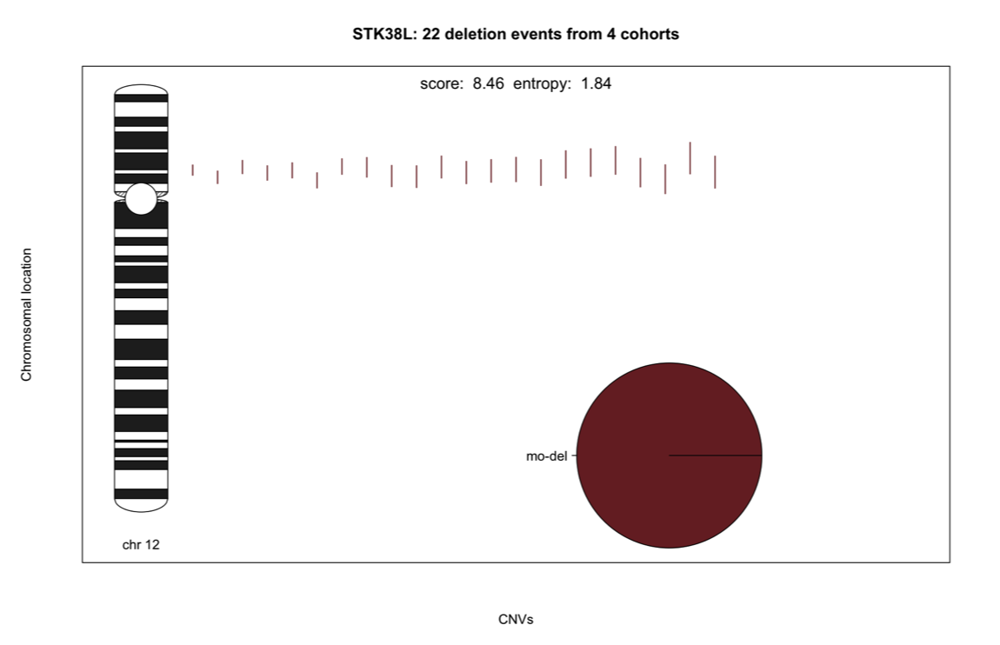

# GenomeTornadoPlot

Authors: Chen Hong<sup>1,2,3</sup>, Robin Thiele<sup>1,2</sup>, Lars Feuerbach<sup>1</sup>

Affiliations:\
1 Division of Applied Bioinformatics, German Cancer Research Center (DKFZ), Heidelberg, Germany.\
2 Faculty of Biosciences, Heidelberg University, Heidelberg, Germany.\
3 German Cancer Consortium (DKTK), German Cancer Research Center (DKFZ), Heidelberg, Germany.


The GenomeTornadoPlot package allow users to visualize copy number variations (CNVs), and many other types of structure variations as well, which overlap with one or two genes in one chromosomes. For all CNVs overlapping with the target gene a focality score is also calculated. Higher the focality score is, more probable it is that the gene is affected by focal events.


## Motivation

Focal copy number variations pinpoint driver genes. More specifically, oncogenes and tumor suppressor genes are more often affected by these events than neighbouring passenger. Furthermore, detection of multigenic minimally deleted regions enable the detection of synergistic co-mutations. 

With the `GenomeTornadoPlot` package, you are able to:
- visualize alternatively selected CNVs overlapping with selected gene at the cohort level as **tornado plots**.
- visualize CNVs of two selected genes in the same chromosome and compare these events 
- calculate **focality scores** with different methods.

## Algorithms of focality score

### Standard focality score
In general, we assume that genes with comparably more focal events than broad ones have higher scores. 
Here we define the standard focality score by:


where m is the total number of focal variation events, L<sub>max</sub> is the length of longest focal variation event.

### Edge score
To erase the impact of neighbour genes, we implemented another algorithm and call it "edge score".  It is defined as:

score.edge = (2*S<sub>gene</sub> - S<sub>neighbour_1</sub> -S<sub>neighbour_2</sub>)/2

where neighbour 1 and neighbour 2 are neighbour genes of the target gene, if the target gene is at edge of chromosome, the only neighbour gene counts as both neighbour 1 and 2.

In short, the edge score is the average difference between standard focality score of one gene with its neighbours.

### User-defined score
Users can also define their own focality scoring methods based on the CNV dataset. The score can be imported to visualization.

It is convenient for users to choose if they want to calculate the standard focality score or the edge focality socre as the "focality score".
Please notice that the focality score of each gene is calculated by the data you give, so it is not a constant value in different datasets.

## Download and installation

Prior to installing GenomeTornadoPlot, please install all dependencies as following:

```R
dependencies.packages = c('ggplot2', 'data.table', 'devtools','grid', 'gridExtra','tiff',"shiny","shinydashboard","entropy")
	      
install.packages(dependencies.packages)

if (!requireNamespace("BiocManager", quietly = TRUE))
    install.packages("BiocManager")
    
BiocManager::install(c('GenomicRanges','quantsmooth','IRanges'))
```
## Workflow
<p align="center">

</p>


## Installing
1. In the Git repository click on "Clone or Download".
2. Copy the HTTPS link.
3. Open a terminal and type or paste:
```bash
git clone https://github.com/chenhong-dkfz/GenomeTornadoPlot
```
4. Open the folder GenomeTornadoPlot and open the “GenomeTornadoPlot.Rproj” file in RStudio.
5. In the RStudio console, type:
```R
devtools::install()
```

## Quick Start

Here we just make a brief quick start to the functions in `GenomeTornadoPlot` with minimal parameters.
For more information, please check the user manual and package help.

### step 0:
Firstly, you can prepare a BED-like data, and import it to R session.
In R, it should be a data frame and look like this:\
(You can download real PCAWG data for test from https://github.com/chenhong-dkfz/GenomeTornadoPlot-files)

```R
load(file = "path to the file/chr17.RData")
chr17 <- cnv_chr
names(chr17)[4] <- "Score"
names(chr17)[6] <- "Cohort"
names(chr17)[7] <- "PID"
knitr::kable(head(chr17, 10))
```
| Chromosome| Start|      End| Score|Gene  |Cohort  |PID                                  |
|----------:|-----:|--------:|-----:|:-----|:-------|:------------------------------------|
|         17|     6| 18318423|     3|DOC2B |BLCA-US |0c7aca3f-e006-4de3-afc2-20b4f727d4fd |
|         17| 12499| 14755572|     3|DOC2B |BLCA-US |2b142863-b963-4cc9-8f8f-c72503c93390 |
|         17|   827| 22199998|     1|DOC2B |BLCA-US |301d6ce3-4099-4c1d-8e50-c04b7ce91450 |
|         17|     6| 10573886|     3|DOC2B |BLCA-US |418a3dec-96ff-4719-becb-e1a8260cce2f |
|         17| 12499|   521774|     4|DOC2B |BLCA-US |448fe471-3f4e-4dc8-a4e0-6f147dc93abe |
|         17|   833| 10272085|     1|DOC2B |BLCA-US |8c619cbc-9e91-4716-9711-5236e55d8f46 |
|         17|  1868|  5317402|     3|DOC2B |BLCA-US |94108975-b7a0-40ba-ad39-e44cc62e8cc0 |
|         17|  2800|  1995288|     3|DOC2B |BLCA-US |973d0577-8ca4-44a1-817f-1d3c1bada151 |
|         17|   833| 22199998|     1|DOC2B |BLCA-US |acc629cb-ad03-4cec-9b21-922e4932ef3e |
|         17|     6|  1706906|     4|DOC2B |BLCA-US |b73523d7-f5a5-4140-8537-4df4d1ecf465 |

The **Score** column records copy numbers of each CNV event.

It is important to make sure colnames of the data frame. **Please pay a attention to the first capital letter of each column name.**

After preparing the data, we can apply 
Plot to our data

 ### Step 1: 
 Run the  `MakeData()` function:

```R
library(GenomeTornadoPlot)
input_gene_1="TP53" 
sdt <- MakeData(CNV=chr17,gene_name_1 = input_gene_1,score.type = "del")

```

Here **CNV** is a BED-like data.frame you just imported.

```R
Focality_score <- sdt@gene_score 
```
Here the focality score will be calculated.

The other parameters are defined as following:

1. **gene_name_1**: the name of the first gene.
2. **gene_name_2**: the name of the second gene (optional).
3. **score.type**: if the value is "del", calculate focality score of deletions.If the value is "dup", calculate focality score of duplications.
4. **score.method**: if the value is "normal", calculate standard focality score.If the value is "edge", calculate edge score. 
5. **gene_score_1**: if the value is given by the user, use this input value as focality score of 1st gene in visualization.
6. **gene_score_2**: if the value is given by the user, use this input value as focality score of 2nd gene in visualization. (optional)

Here **sdt** is an R object containing information of the CNV of selected genes. And it should be input of step 2.

### Step 2:
Run the `TornadoPlots()` function:

```R

plotlist1 <- TornadoPlots(data=sdt,color.method="ploidy",sort.method="length",multi_panel=FALSE)

```
1. **data**: R object generated by `MakeData()` function.
2. **legend**: could be set to “pie”(default) or "barplot" (optional).
3. **color**: a vector of CNV colors, optional.
4. **color.method**: how to color the CNVs. It could be “cohort”(default) or “ploidy”(optional).
5. **sort.method**: how to sort the CNVs. It could be “length”(defult), "cohort" or "ploidy" (optional).
6. **SaveAsObject**: if TRUE, returns an rastergrob object. if FALSE the function only saves the plot.
7. **format**: if SaveAsObject is FALSE, the packge will save the plots in files. if this value is "tiff", the plot will be saved as a tiff image. if this value is "eps", the plot will be saved as an EPS vector image.
8. **path**: if SaveAsObject is FALSE, the packge will save the plots in files. the image will be saved in the path in disk.
9. **multi_panel**: if TRUE, a multiple panel plot will be displayed.
10. **zoomed**: if TRUE, a zoomed-in plot for details will be displayed.
11. **orient**: if the value is "v", vertical arranged plots will be displayed. if the value is "h", horizontal arranged plots will be displayed.
12. **font.size.factor**: rescale of fonts shown in the plots.

Here **plotlist1** is a list, containing output of plots.

In the first step, if you give only **gene_name_1**, you will get a standard tornado plot and “dup_del ” plot for this gene after you finish step 2. Otherwise, if you also give the *gene_name_2*, you will get a “twin” plot and a “mixed” plot.

## GenomeTornadoPlot Easy2Use (shinyapp)

In order to help users generate genome tornado plots in a convenient way, we provided a shiny app in GenomeTornadoPlot package. Users could launch the shiny app in R console.

```R
runExample()
```
Users could upload CNV files from local computer, set the parameters and download generated plots in the shiny app.

<p align="center">

</p>


## Examples

Here you can simply use the following code to make a tornado plot. Dummy data is attached in the package. The first example is for a single gene. 

```R
data("cnv_STK38L", package = "GenomeTornadoPlot")
data_genea <-  MakeData(CNV=cnv_STK38L,gene_name_1 = "STK38L",score.type="del")
plotlist1 <- TornadoPlots(data_genea,gene.name="STK38L",color.method="ploidy",
                          sort.method="length",SaveAsObject=TRUE,multi_panel=FALSE,orient="v")
```
If what you need is just the focality score, just use the following command:
```R
data_genea@gene_score
```

If you want to go further, try printing a standard Genome Tornado Plot:
```R
grid.arrange(plotlist1[[1]])
```

<p align="center">

</p>


Colored lines stand for CNV events. In the plot, you can easily find out their locations in chromosomes.
The pie chart stand for the cohort contribution of the events.
The colors in this example stand for cohort. But users can also change parameter and make the color for copy numbers or length.  
The score below the graph is the “focality score” of the gene.  


In some cases, a gene plays different roles in different cohorts. A deletion/duplication plot helps identifying that.
```R
grid.arrange(plotlist1[[2]])
```


<p align="center">

</p>


Here, the gene of interest is duplicated in most cohorts, whereas deletions are more frequent in some others.


We make another example of gene PTEN.

```R
load(file = "path to file/chr10.RData")   
chr10 <- cnv_chr
names(chr10)[4] <- "Score"
names(chr10)[6] <- "Cohort"
names(chr10)[7] <- "PID"

input_gene_1="PTEN"

sdt <- MakeData(CNV=chr10,gene_name_1 = input_gene_1,score.type = "del", gene_score_1 = 30)
print(sdt@gene_score)
```
Here we set parameter gene_score_1 to 30 and we will see the focality score will be 30.

```R
sdt <- MakeData(CNV=chr10,gene_name_1 = input_gene_1,score.type = "del")
print(sdt@gene_score)
```
If we don't set any value to gene_score_1, the function will calculate focality score with default 'normal' method.

Then we plot the tornado plots wih different sorting and color methods.

```R
plotlist1 <- TornadoPlots(sdt,color.method="cohort",sort.method="cohort",multi_panel=FALSE,
                          font.size.factor=1.5,orient="v")
grid.arrange(plotlist1[[1]])
```
Sort by cohort and color by cohort.
<p align="center">

</p>

```R
plotlist1 <- TornadoPlots(sdt,color.method="ploidy",sort.method="cohort",multi_panel=FALSE,
                          font.size.factor=1.5,orient="v")
grid.arrange(plotlist1[[1]])
```
Sort by cohort and color by ploidy.
<p align="center">

</p>

```R
plotlist1 <- TornadoPlots(sdt,color.method="ploidy",sort.method="length",multi_panel=FALSE,
                          font.size.factor=1.5,orient="v")
grid.arrange(plotlist1[[1]])
```

Sort by length and color by ploidy.
<p align="center">

</p>


Users can also rotate the plot and **vertically** arrange the CNVs by set **orient** to "h" and **zoomed** to TRUE.

```R
plotlist1 <- TornadoPlots(sdt,color.method="ploidy",sort.method="length",multi_panel=FALSE,
                          font.size.factor=1.5, orient="h",zoomed=TRUE)
grid.arrange(plotlist1[[1]])
```
<p align="center">

</p>

```R
grid.arrange(plotlist1[[1]])
```
<p align="center">

</p>

In this case, the users are able to look into details of the events. The dashlines here indicates the start and end position of gene PTEN.

We can also draw a multiple panel plot by setting multi_panel TRUE. The detail gene/variation stats, different levels tornado plots and zoomed-in plot will be displayed in a complex plot.

```R
TornadoPlots(sdt,color.method="ploidy",sort.method="length",multi_panel=TRUE,
             font.size.factor=1.5, orient="v",zoomed=TRUE)
```
<p align="center">

</p>


We can also apply `GenomeTornadoPlot` for gene pairs.
```R
load(file = "path to file/chr21.RData")   
chr21 <- cnv_chr
names(chr21)[4] <- "Score"
names(chr21)[6] <- "Cohort"
names(chr21)[7] <- "PID"
input_gene_1="ERG"
input_gene_2="TMPRSS2"

sdt <-  MakeData(CNV=chr21,gene_name_1 = input_gene_1,gene_name_2=input_gene_2,score.type="del")
plot_twin <- TornadoPlots(sdt,sort.method="cohort",SaveAsObject=T,multi_panel=FALSE)
```
Plot twin plot:
```R
grid.arrange(plot_twin[[1]])
```
<p align="center">

</p>

In addition, the mixed plot shows the proportion of CNVs which overlap gene 1 alone, gene 2 alone or both genes.  
plot mixed plot:
```R
grid.arrange(plot_twin[[2]])
```
<p align="center">

</p>


## References

[1]G.R. Bignell, C.D. Greenman, H. Davies, A.P. Butler
Signatures of mutation and selection in the cancer genome
Nature, 463 (2010), pp. 893-898

[2]M. Bierkens, O. Krijgsman, S.M. Wilting, L. Bosch, A. Jaspers, G.A. Meijer, et al.
Focal aberrations indicate EYA2and hsa-miR-375as oncogene and tumor suppressor in cervical carcinogenesis
Genes Chromosom. Cancer, 52 (2012), pp. 56-68

[3]C. Garnis, W.W. Lockwood, E. Vucic, Y. Ge, L. Girard, J.D. Minna, et al.
High resolution analysis of non-small cell lung cancer cell lines by whole genome tiling path array CGH
Int. J. Cancer, 118 (2005), pp. 1556-1564

[4]R.J. Leary, J.C. Lin, J. Cummins, S. Boca, L.D. Wood, D.W. Parsons, et al.
Integrated analysis of homozygous deletions, focal amplifications, and sequence alterations in breast and colorectal cancers
Proc. Natl. Acad. Sci. U. S. A., 105 (2008), pp. 16224-16229

[5]Meuwissen R, Linn SC, Linnoila RI, Zevenhoven J, Mooi WJ, Berns A. Induction of small cell lung cancer by somatic inactivation of both Trp53 and Rb1 in a conditional mouse model. Cancer Cell. 2003;4(3):181–9.

[6]Campbell, P. J. et al. Pan-cancer analysis of whole genomes. bioRxiv (2017).

[7]Cancer Genome Atlas Research Network, Weinstein JN, Collisson EA, et al. The Cancer Genome Atlas Pan-Cancer analysis project. Nat Genet. 2013;45(10):1113–1120. doi:10.1038/ng.2764

## Licence
GPL-3.0
